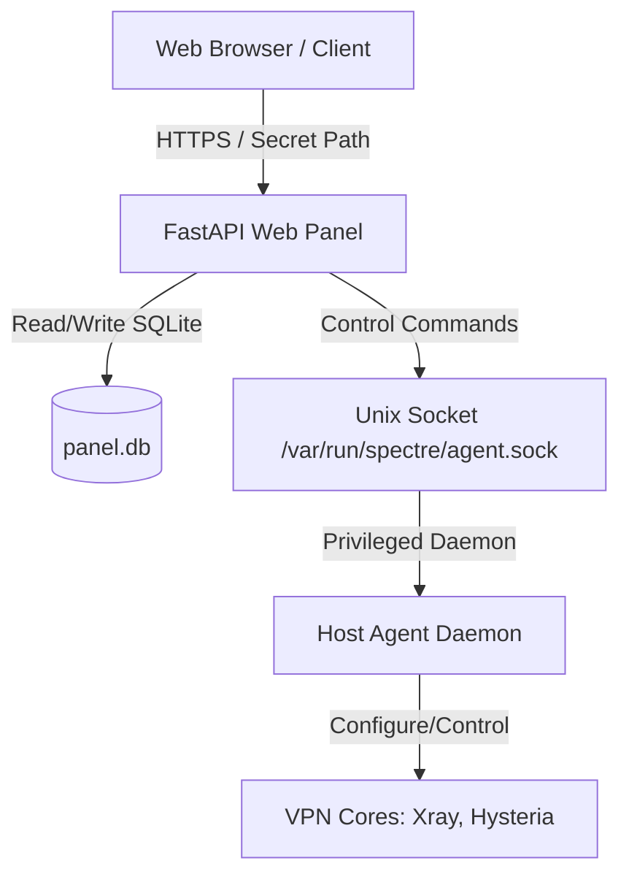

# System Architecture & Trust Boundaries (Run 2)

## 1. System Overview
Spectre Panel is a secure, lightweight control panel for managing VPN cores (Xray and Hysteria 2). The application separates the high-privilege configuration daemon from the web interface to prevent administrative access compromise.

## 2. Trust Boundaries & Attack Surfaces
*   **External Boundary (Internet facing)**:
    *   `/{settings.PANEL_SECRET_PATH}/` - Static files web UI and API endpoints. Auth required.
    *   `/login` - Administrative login endpoint. Protected by fail delays and max login attempts.
    *   `/decoy` - Static files and proxy masking routes. Unauthenticated traffic is forwarded/masked to prevent identification.
*   **Internal Boundary (Host network/sockets)**:
    *   `/var/run/spectre/agent.sock` - Unix socket used for IPC communication between FastAPI and the Host Agent. Root permissions required to access the socket file.
*   **API Authentication**:
    *   Web Panel UI: Uses cookie sessions / JWTs and CSRF tokens.
    *   Mini App / Telegram Bot: Uses HMAC signature verification checks.

## 3. Scope of Changes (Since Run 1)
*   **UI Redesign Integration**: Copied upgraded styling resources, layout configurations, and cache buster version parameters into the main `frontend/` folder.
*   **Decoupled Upgraded Routes**: Reverted/removed the experimental `_upgrade` mounting block in `backend/main.py`.
*   **SQLite Fallback**: Local configuration updated to SQLite database (`panel.db`) as fallback in case PostgreSQL local connection is refused.
